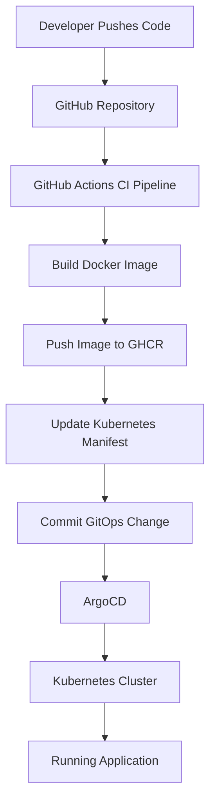

# GitOps CI/CD Platform with GitHub Actions, ArgoCD & Kubernetes

A production-style CI/CD and GitOps pipeline that automates building, containerizing, and deploying a Python application to Kubernetes using GitHub Actions, GitHub Container Registry (GHCR), and ArgoCD.

This project demonstrates a complete end-to-end software delivery workflow used in modern platform engineering environments.

---

## Architecture Overview


---

## Tech Stack

* GitHub Actions
* Docker
* GitHub Container Registry (GHCR)
* Kubernetes
* ArgoCD
* Python (Flask)

---

## How the System Works

### Continuous Integration (CI)

On every push to `main`:

* GitHub Actions builds a Docker image
* The image is tagged using the Git commit SHA
* The image is pushed to GHCR

### GitOps Deployment (CD)

* GitHub Actions updates the Kubernetes deployment manifest
* The updated manifest is committed back to Git
* ArgoCD detects the change
* ArgoCD synchronizes Kubernetes with the desired state stored in Git

### Continuous Reconciliation

* ArgoCD continuously compares cluster state with Git state
* Drift is automatically corrected through self-healing

---

## Repository Structure

```text
.
├── .github/workflows/
├── app.py
├── Dockerfile
├── requirements.txt
├── gitops/
│   ├── dev/
│   ├── stage/
│   └── prod/
├── k8s/
├── scripts/
└── test_app.py
```

---

## Deployment Flow

1. Developer pushes code to GitHub
2. GitHub Actions builds a container image
3. Image is pushed to GHCR
4. Deployment manifest is updated
5. ArgoCD detects the change
6. Kubernetes is synchronized automatically

---

## What I Built

* End-to-end CI/CD pipeline using GitHub Actions
* Containerized Python application using Docker
* GitOps deployment workflow using ArgoCD
* Kubernetes deployment automation
* Image versioning using Git commit SHA
* Environment-based GitOps structure

---

## Key Learnings

* GitOps reconciliation model
* Kubernetes deployment lifecycle
* Container image management
* CI/CD pipeline automation
* ArgoCD synchronization and self-healing
* Troubleshooting real-world deployment issues

---

## Future Improvements

* Helm-based deployments
* Environment promotion workflow
* Automated rollback strategy
* Monitoring with Prometheus and Grafana
* Policy enforcement with OPA/Gatekeeper


